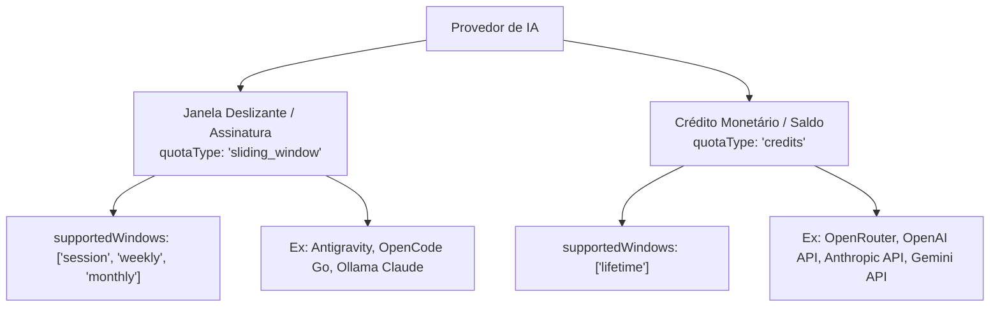

# Guia de Arquitetura e Integração de Conectores (LLM Quota)

Este documento estabelece o padrão arquitetural obrigatório para o desenvolvimento, registro e sincronização de conectores de provedores de IA no **llm-quota**. O cumprimento destas diretrizes garante que novos provedores sejam sincronizados no momento exato em que forem cadastrados e que suas janelas de cota sejam representadas com exatidão sem cair em defaults inadequados.

---

## 1. Classificação Arquitetural de Provedores

Os provedores de IA no llm-quota são estritamente divididos em duas categorias:



### 1.1 Provedores de Janela Deslizante (`quotaType: "sliding_window"`)
- **Conceito**: Planos de assinatura (Pro/Team/Enterprise) ou limites de taxa que renovam o consumo em janelas temporais móveis.
- **Padrão da Plataforma**: **`["session", "weekly"]`** (e opcionalmente `monthly`, como no **OpenCode Go**).
- **Atenção Mandatória**: **`daily` NÃO é uma janela de cota ativa**. Limites diários de cotas não existem em provedores modernos (foram substituídos por sessões de 5 horas ou limites semanais). O agregador diário (`daily`) existe exclusivamente no banco de dados para consolidação histórica de consumo (`history` / `daily_aggregates`). Nunca declare `"daily"` em `supportedWindows` de cotas ativas.
- **Grupos de Modelos (Model Groups)**: Quando o provedor possui múltiplos agrupamentos com cotas separadas (como o Google Antigravity dividindo **GEMINI MODELS** e **CLAUDE AND GPT MODELS**), retorne a propriedade `modelGroups` no snapshot contendo o nome do grupo, lista de modelos e os limites de 5 horas (`session`) e semanais (`weekly`).

### 1.2 Provedores por Créditos / Saldo (`quotaType: "credits"`)
- **Conceito**: Pagamento por consumo (*pay-as-you-go*) ou recargas monetárias pré-pagas onde o saldo decresce conforme o uso.
- **Exemplos**: **OpenRouter**, conexões de API direta da **OpenAI** (`api.openai.com`), **Anthropic API** (`api.anthropic.com`), **Gemini API** (`generativelanguage.googleapis.com`).
- **Padrão da Plataforma**: **`["lifetime"]`** (snapshot único de estoque/saldo de créditos da conta).
- **Motivação**: Provedores de crédito não possuem cotas rotativas de sessão ou semana. Polling com janelas temporais geraria registros redundantes sem sentido para o saldo da conta.

---

## 2. Contrato `ProviderConnector`

Todo conector implementa a interface `ProviderConnector` localizada em [`packages/providers/src/index.ts`](file:///home/daniel/Code/llm-quota/packages/providers/src/index.ts):

```typescript
import type { ConnectionType, Quota, QuotaWindow } from "@llm-quota/shared";

export interface ProviderConnector {
  /** Identificador estável do conector, ex: 'opencode-go/api', 'antigravity/oauth' */
  readonly id: string;
  /** Nome amigável de exibição */
  readonly name: string;
  /** Tipo de conexão suportada: 'api' ou 'oauth' */
  readonly connectionType: ConnectionType;
  /** Natureza da cota: 'sliding_window' ou 'credits' */
  readonly quotaType?: "sliding_window" | "credits";
  /** Janelas suportadas pelo provedor (ex: ['session', 'weekly', 'monthly']) */
  readonly supportedWindows?: readonly QuotaWindow[];
  /** Função de leitura de cota para uma conexão */
  fetchQuota(context: ProviderContext): Promise<QuotaSnapshot>;
  /** Autodescoberta opcional de rótulo (e-mail, nome da conta) */
  discoverLabel?(context: ProviderContext): Promise<string | null>;
}
```

### Contexto de Execução (`ProviderContext`)
Ao invocar `fetchQuota`, o coletor envia:
- `connectionId`: ID da conexão no banco de dados.
- `connectionType`: `'api'` ou `'oauth'`.
- `apiKey`: Segredo descriptografado em memória (nunca registrado em logs).
- `oauth`: Credenciais OAuth completas (`accessToken`, `refreshToken`, `expiresAt`, `clientId`, `clientSecret`).
- `window`: A janela específica sendo coletada (`"session"`, `"weekly"`, `"monthly"` ou `"daily"`).
- `saveSecret`: Callback assíncrono para atualizar segredos (usado em rotações de access token OAuth).
- `http`: Instância de `HttpClient` injetada para testes isolados sem rede real.

---

## 3. Pipeline de Sincronização

A sincronização de cotas opera sob dois pilares complementares:

### 3.1 Sincronização Imediata (Event-Driven)
Quando o usuário cria ou atualiza uma conexão:
1. `POST /v1/connections`
2. `PATCH /v1/connections/:id`
3. `POST /v1/connections/oauth/antigravity/callback`

O backend invoca `triggerCollectorSync(connectionId)`:
- A coleta daquela conexão específica é executada **naquele exato momento**.
- O parâmetro `lastCollectedAt` é anulado para que a coleta ignore qualquer regra de debounce e consulte o provedor upstream imediatamente.
- O endpoint HTTP aguarda com uma corrida de timeout de até 1.5s: se o provedor responder rápido, a cota já estará no banco antes da resposta HTTP retornar para a SPA; caso demore mais, a resposta HTTP retorna normalmente e a coleta conclui em background.

### 3.2 Polling Periódico e Agendamento
- Um loop periódico em `apps/api/src/server.ts` roda a cada `COLLECT_INTERVAL_MS` (default 60s).
- Executa sob o contexto de segurança RLS `app.is_collector = 'true'` para listar todas as conexões cadastradas.
- Para cada conexão, obtém as janelas através da resolução:
  ```typescript
  const windowsToPoll = connector?.supportedWindows && connector.supportedWindows.length > 0
    ? connector.supportedWindows
    : connector?.quotaType === "credits"
      ? ["daily"]
      : ["session", "weekly"];
  ```
- Para cada janela, executa `runCollectPass`, validando se a janela está vencida conforme `COLLECTION_INTERVALS`.
- Grava os snapshots em `quota_snapshots` isolados pelo tenant (`user_id`).

---

## 4. Checklist Obrigatório para Novos Conectores

Ao implementar uma nova integração (ex: OpenAI API, Anthropic API, Gemini API, Claude Code, etc.), siga rigorosamente os seguintes passos:

### Passo 1: Criar o Pacote do Conector
Crie o conector em `packages/providers/connectors/<nome-do-provedor>/`:
- Defina `package.json` com `@llm-quota/connector-<nome>`.
- Configure `tsconfig.json` e `vitest.config.ts`.
- Adicione a dependência em `apps/api/package.json`.

### Passo 2: Implementar o Conector e Classificar a Cota
No arquivo `src/index.ts` do conector:
- Defina `quotaType`:
  - Se for cota por crédito/consumo em dólares (ex: OpenRouter, OpenAI API, Anthropic API): `quotaType: "credits"`, `supportedWindows: ["lifetime"]`.
  - Se for assinatura/janela de modelo (ex: Antigravity, OpenCode Go): `quotaType: "sliding_window"`, `supportedWindows: ["session", "weekly"]`.
- Se o provedor possuir janela mensal (como OpenCode Go): inclua `"monthly"` em `supportedWindows`.
- No parser `parseQuota(body, window)`:
  - Extraia `usedPercent`, `remainingPercent` e `resetsAt` para cada janela solicitada.
  - Para créditos: retorne `kind: "credits"`, `currency`, `total` e `used`.

### Passo 3: Escrever Testes Unitários com Fixtures
Crie `test/connector.test.ts`:
- Teste o parser para cada janela suportada (`session`, `weekly`, `monthly` ou `credits`).
- Teste o método `fetchQuota` usando um mock de `HttpClient` (`stubHttp`).
- Execute `pnpm --filter @llm-quota/connector-<nome> test`.

### Passo 4: Registrar no Registry do Sistema
Adicione o conector nas fábricas de registro:
1. Em [`apps/api/src/server.ts`](file:///home/daniel/Code/llm-quota/apps/api/src/server.ts) dentro de `createDefaultRegistry()`:
   ```typescript
   registry.register(novoConnector);
   ```
2. Em [`apps/api/src/app.ts`](file:///home/daniel/Code/llm-quota/apps/api/src/app.ts) dentro de `defaultRegistry()`:
   ```typescript
   r.register(novoConnector);
   ```
3. Em [`packages/db/src/seed.ts`](file:///home/daniel/Code/llm-quota/packages/db/src/seed.ts) para cadastrar a chave no catálogo de provedores suportados.

### Passo 5: Atualizar Frontend e Localização
- Em [`apps/web/src/views/ConnectionsView.vue`](file:///home/daniel/Code/llm-quota/apps/web/src/views/ConnectionsView.vue): adicione a opção no formulário de seleção de provedores.
- Em [`packages/i18n/locales/`](file:///home/daniel/Code/llm-quota/packages/i18n/locales/): garanta as traduções de nome e orientações de chave API.

### Passo 6: Validação de Ponta a Ponta
1. Execute `pnpm test` em todo o monorepo.
2. Execute `pnpm -r build`.
3. Inicie o servidor e cadastre uma conexão do novo provedor:
   - Verifique nos logs se a mensagem `[collector] connection=... collected=...` foi impressa **imediatamente**.
   - Verifique no Dashboard se os cartões de cota renderizaram com as janelas corretas (sem agrupamento incorreto em `"daily"` para provedores de janela deslizante).
